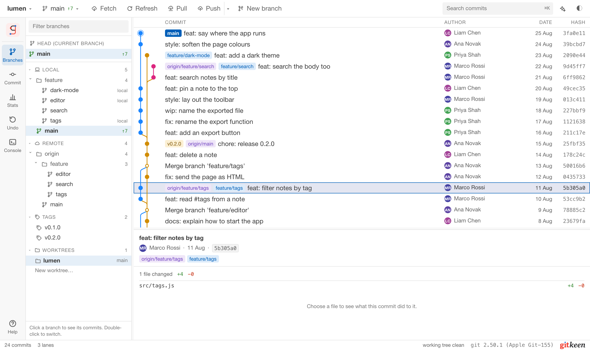
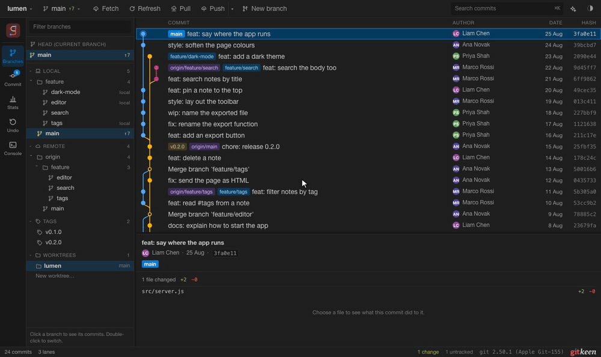
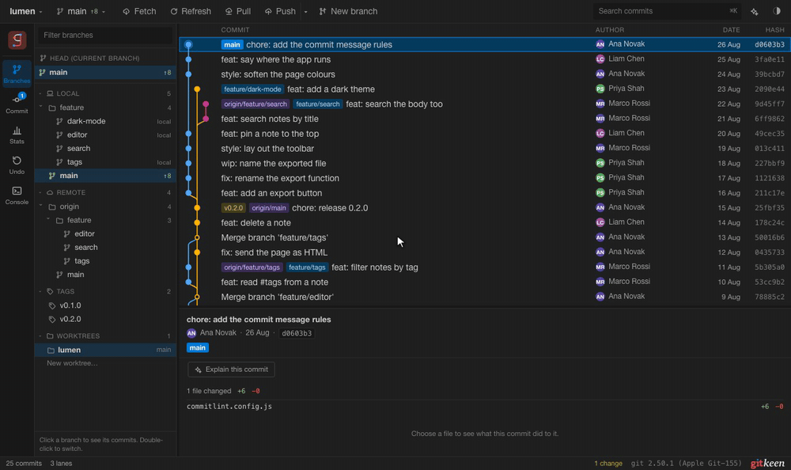
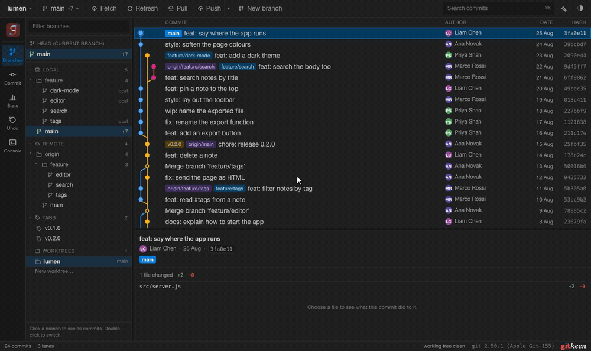
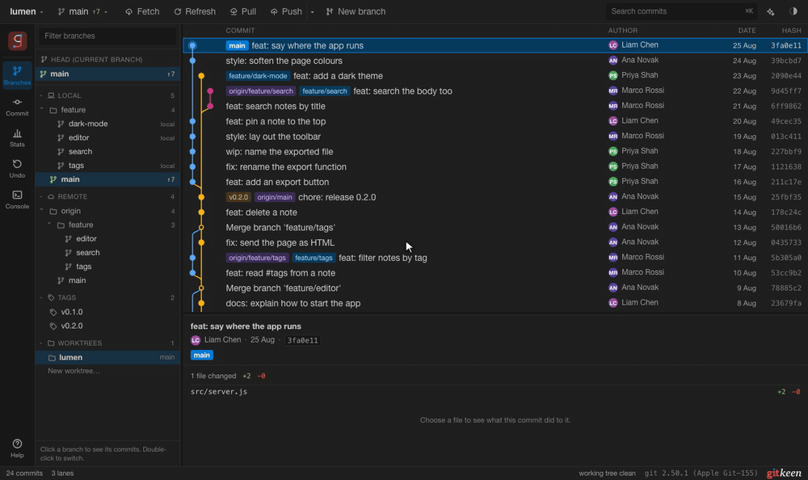
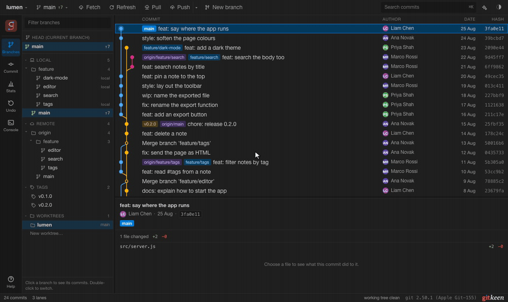

<h1>
  <picture>
    <source media="(prefers-color-scheme: dark)" srcset="brand/logo-dark.svg">
    
  </picture>
</h1>

Gitkeen is a visual Git client that works next to any editor. Your editor
writes code. Gitkeen manages your commits, history and more.

You see the whole commit graph, commit exactly the lines you want, and change
history with a few clicks. Before anything risky happens, Gitkeen tells you
what it will do, and afterwards the Undo panel can put it back.

<picture>
  <source media="(prefers-color-scheme: dark)" srcset="docs/media/overview-dark.png">
  
</picture>

## Why Gitkeen

| | |
|---|---|
| **See everything** | The full commit graph, with branches, merges and tags as lanes. Search the whole history by message, author, file or date. |
| **Commit precisely** | Stage whole files, single hunks or single lines. What you tick is exactly what Git's index holds. |
| **Rewrite history safely** | Squash, reorder, reword, drop, cherry-pick, revert and reset from the commit menu, or plan a whole rebase and drag the commits into order. |
| **Know before you act** | Every risky operation says what it will change first: which commits a force push removes, which files a merge will conflict on. |
| **Undo it** | Gitkeen saves a recovery point before it rewrites or deletes anything. One click on **Restore** puts it back. |
| **Keep your editor** | Gitkeen does not edit code. Use any editor you like. |
| **Still type commands** | The console runs Git commands with suggestions from your repository, and shows the result as a picture. |

## Download

Download Gitkeen from the [Releases page](https://github.com/tgomilar/gitkeen/releases).
Open the newest release, and under **Assets** choose the file for your system:

| Your system | File |
|---|---|
| macOS on Apple silicon (M1 and newer) | `Gitkeen-macOS-Apple-silicon.dmg` |
| macOS on Intel | `Gitkeen-macOS-Intel.dmg` |
| Windows 10 and 11 | `Gitkeen-Windows-Installer.exe` |
| Linux | `Gitkeen-Linux.AppImage` |
| Debian and Ubuntu | `Gitkeen-Linux.deb` |

You also need Git 2.30 or newer. The app is not signed yet, so macOS and
Windows ask once before they open it: [Installing Gitkeen](docs/install.md)
shows the steps. Gitkeen is a pre-release for now. From the first full
release on, it updates itself when a new version is out.

## Run it from source

You need Git 2.30 or newer and Node.js 20 or newer.

1. Install the dependencies: `npm install`
2. Start Gitkeen: `npm run dev`
3. Open `http://localhost:5183`.
4. Paste the path of a repository and press **Open**.

## A quick tour

**The graph.** Every commit, branch and tag in one view. Click a commit to read
its message and changed files. Shift and Command select several commits, and a
right click shows everything you can do with them.
[Getting started](docs/getting-started.md)

**The commit panel.** Tick files to stage them, or open the diff viewer to stage
single hunks and lines. Amend the last commit, sign it, or set work aside in a
stash. [Committing](docs/committing.md)

**Commit messages.** Gitkeen reads the repository's commitlint rules and names
each broken rule while you type. **Suggest** writes a subject that follows them,
with an AI model of your choice. [Commit messages](docs/committing.md#commit-messages)

**The rebase editor.** Right click a commit and choose **Rebase from here**. Drag
commits into a new order, and choose pick, reword, edit, squash, fixup or drop
for each one. Nothing runs until you press **Start rebase**.
[Changing history](docs/history.md)

**The merge editor.** When a merge, pull or rebase stops on a conflict, resolve
each block by keeping ours, theirs or both, or edit the result by hand.
[Branches, remotes and conflicts](docs/branches-and-remotes.md)

**The Undo panel.** Every reset, squash, rebase, drop, deleted branch and force
push is listed. **Restore** puts things back as they were. [Undo](docs/undo.md)

**The console.** Type `status`, `log` or `switch main`, with suggestions for
commands, options, branches and files. [The console](docs/console.md)

## Documentation

| Page | What it covers |
|---|---|
| [Installing Gitkeen](docs/install.md) | Which file to download, opening the app the first time, updates |
| [Getting started](docs/getting-started.md) | Starting Gitkeen, the window, selecting commits, the command palette |
| [Committing](docs/committing.md) | The commit panel, the diff viewer, stashes, signed commits |
| [Changing history](docs/history.md) | Cherry-pick, revert, reset, squash, the rebase editor, moving and dropping commits |
| [Branches, remotes and conflicts](docs/branches-and-remotes.md) | Branches, push, pull, merge, tags, the merge editor |
| [Finding things](docs/finding-things.md) | Search, blame, bisect, compare |
| [Undo](docs/undo.md) | Recovery points and restoring an operation |
| [The console](docs/console.md) | Typing Git commands, and what keeps them safe |
| [The Stats report](docs/stats.md) | Who committed what, and when |
| [GitHub and AI help](docs/github-and-ai.md) | Pull requests and checks, and explanations from an AI model |
| [More features](docs/more-features.md) | Worktrees, submodules, Git LFS, patches and bundles |
| [Themes and text size](docs/appearance.md) | Light and dark, five colour palettes, text size |
| [Keyboard shortcuts](docs/keyboard.md) | Every key |
| [The desktop app](docs/desktop-app.md) | What is different in the app, and building it yourself |
| [Development](docs/development.md) | How Gitkeen is built, the code, the tests, the logo |

## The most useful keys

| Key | Action |
|---|---|
| ? | Open Help: what Gitkeen can do, with the shortcuts. |
| Command or Control with Shift and P | Open the command palette, which lists everything Gitkeen can do. |
| Command or Control with K | Search the history. |
| Command or Control with Shift and K | Write a commit message. |
| Command or Control with B | Switch branch. |
| Control with \` | Open the console. |

See [all keyboard shortcuts](docs/keyboard.md).

## Licence

Gitkeen is released under the [MIT licence](LICENSE). It is developed and
maintained by Tanja Gomilar, with the help of AI.
