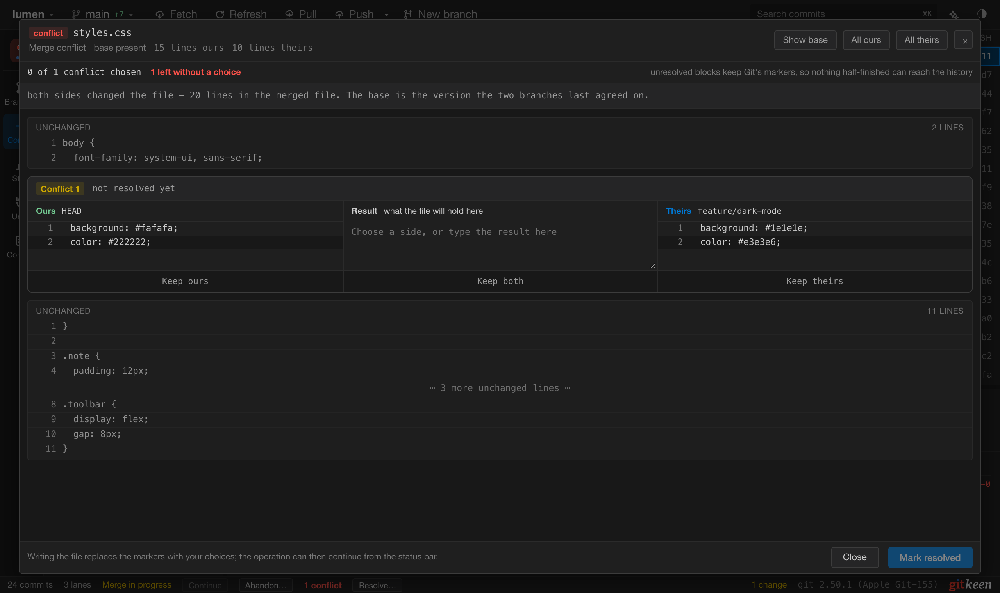

# Branches, remotes and conflicts

This page covers branches, push, pull, merge, tags, and resolving conflicts.

## Branches

The **Branches** panel lists your local branches, the branches on each remote,
the tags, and the worktrees. The branch you are on is pinned at the top.
Branch names with slashes, such as `feature/login`, are grouped in folders.

| To do this | Do this |
|---|---|
| Switch branch | Double click the branch, or press Command or Control with B and choose it. |
| Create a branch | Press **New branch** in the title bar, or right click a commit and choose **Create branch from here…**. Command or Control with Shift and B creates one at the selected commit. |
| Rename or delete a branch | Right click it. |
| Check out a remote branch | Double click it in the Remote section. Gitkeen creates a local branch that tracks it. |

Before a branch is deleted, Gitkeen asks Git three questions: is the branch
merged, is there a copy on a remote, and how many commits would be lost. The
dialog shows the answers. Gitkeen forces the delete only when commits would be
lost, and only after you agree. The [Undo panel](undo.md) can create a deleted
branch again.

## Push

Press **Push** in the title bar, or Command or Control with Shift and U. The
dialog says which branch goes where and how many commits it sends. A new branch
is created on the remote.

When the remote has commits you do not have, Git refuses a normal push. The
dialog then offers two ways out: pull first, which keeps the remote's commits,
or force push, which replaces them.

**Force push** is also behind the arrow next to Push. Its dialog names the
commits on the remote that it would remove. If the remote changed since your
last fetch, the force push is refused, so it never removes work you have not
seen. The Undo panel keeps the old remote tip, so you can put it back.

## Pull

Press **Pull**, or Command or Control with Shift and L. Gitkeen fetches first,
then shows what is coming before anything changes: how many commits, how many
files, and the first few commits by subject, author and age.

Pull always merges and never rebases, so your commits are never rewritten and
a pull never makes a force push necessary. Git's `pull.rebase` setting is
ignored on purpose, so what the dialog describes is what runs.

| Situation | What happens |
|---|---|
| You have no commits of your own | The branch moves forward to the remote. No merge commit is made. |
| You and the remote both have new commits | Git merges them with a merge commit. |
| The remote has nothing new | Gitkeen says so and stops. |

A pull does not start when you have uncommitted changes, when another operation
is running, when the branch tracks no remote branch, or when HEAD is detached.
Gitkeen names the reason. Untracked files do not block a pull.

## Merge

Right click a branch, local or remote, and choose **Merge into** followed by
the name of your current branch.

Before anything changes, Gitkeen asks Git what the merge would do and shows it:
how many commits are coming, how many files they touch, and **which files would
conflict**. This is a real answer from Git. Finding it out does not touch your
working tree.

| Situation | What happens |
|---|---|
| Your branch has no commits of its own | Gitkeen fast-forwards it. No merge commit is made, and the dialog says so. |
| Both branches have new commits | Git joins them with a merge commit. Nothing on either branch is rewritten. |
| The branch is already contained in yours | Gitkeen says so and stops. |

Merging is refused, with the reason, when you have uncommitted changes, when
another operation is running, or when HEAD is detached.

## Tags

Right click a commit and choose **New tag here**. To tag HEAD, right click the
**Tags** heading in the Branches panel. Gitkeen checks the name against Git's
rules, then asks for an optional description:

| You type | You get |
|---|---|
| A description | An annotated tag, which records who made it and when. Use these for releases. |
| Nothing | A lightweight tag: a name that points at the commit. |

Right click a tag to create a branch from it, copy its name, or delete it.
Deleting a tag that was pushed removes it only from your repository. The dialog
says which remotes still have it, and your next fetch can bring it back.

## Resolving conflicts

A merge, pull, cherry-pick, revert or rebase can stop on a conflict. The status
bar then shows which operation is open:

| Button | What it does |
|---|---|
| Resolve… | Opens the merge editor for the conflicted files. |
| Continue | Finishes the operation. It stays off until no file has a conflict. |
| Abandon | Puts the branch back as it was before the operation started. |

The conflicted files are also listed in red in the commit panel. Right click
one and choose **Resolve in Merge Editor…**.

### The merge editor

The editor shows each conflict in three columns: **Ours** on the left,
**Theirs** on the right, and the **Result** in the middle. **Keep ours**,
**Keep theirs** or **Keep both** fills the result. You can then edit the result
by hand, and **Undo edits** goes back to the side you chose. **Show base**
shows the version both sides started from.

| Side | In a merge, cherry-pick or revert | In a rebase |
|---|---|---|
| Ours | The branch you are on. | The branch you are rebasing onto. |
| Theirs | The commit or branch coming in. | Your own commit, being replayed. |

During a rebase the editor says which side is which, because the names are the
reverse of what most people expect.

**Mark resolved** saves the file and tells Git the conflict is resolved. When
one side deleted the file and the other changed it, you choose between the
changed file and **Delete the file**.

Gitkeen refuses to mark a file that still contains conflict markers, so a line
such as `<<<<<<<` cannot reach your history by accident. Binary files and
symbolic links are resolved outside Gitkeen, then marked resolved from the
commit panel.

The editor changes one conflict at a time. It cannot edit the text outside the
conflicts.
