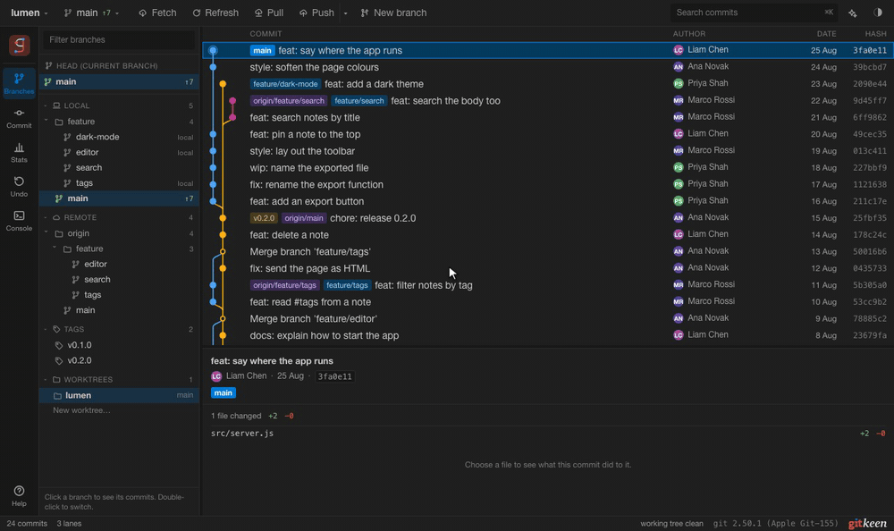

# Committing your work

This page covers the commit panel, the diff viewer, stashes and signed commits.

## The commit panel

Choose **Commit** in the rail. The panel lists everything in your working tree
that differs from the last commit, in two groups:

| Group | What it holds |
|---|---|
| Changes | Files Git already tracks: edited, added, deleted or renamed. |
| Unversioned Files | Files Git has never seen. |

A file starts ticked only if it is already staged. Nothing else joins a commit
until you tick it, so a build folder or an editor settings file never ends up
in a commit because you did not notice it.

### A tick is a real stage

Ticking a file runs `git add`, and unticking it runs `git reset`. The panel
always shows what Git's index holds. Stage a file with `git add` in a terminal
and it appears ticked. Unstage it and it loses its tick.

When only part of a file is staged, its box shows a dash and the row says
**partly staged**. Click the box once to stage the rest of the file. Click it
again to unstage the whole file.

Press **Commit**, or Command or Control with Enter in the message box. Gitkeen
commits exactly what the index holds: the ticked files and, for a partly staged
file, only the staged hunks. A renamed file is one row, and Gitkeen records it
as a rename.

The colour of a file name shows its state:

| Colour | Meaning |
|---|---|
| Blue | Edited or renamed. |
| Green | New and already staged. |
| Grey, with a line through it | Deleted. |
| Brown | Git has never seen this file. |
| Red | The file has a merge conflict. |

### Amend

Tick **Amend** to replace the previous commit instead of making a new one. The
message box fills with that commit's message, and gives your own text back if
you untick it. If the commit is already on a remote, Gitkeen says so first,
because publishing the replacement needs a force push.

### When the rules change

The panel says so on screen in these two cases:

1. While a merge or a rebase is unfinished, Git commits the whole working tree.
   The tick boxes stop applying.
2. A file with a merge conflict cannot be committed until you resolve it.
   Gitkeen names those files.

### Rolling back a file

Right click a file and choose **Roll back** to throw away your changes to it.
A newly added file becomes unversioned again and stays on disk. Gitkeen never
deletes a file. The [Undo panel](undo.md) can bring the changes back.

The toolbar above the list groups the files by folder, opens and closes those
folders, and reads the working tree again.

## Commit messages

Gitkeen checks the message as you type, against the rules of the repository
you opened. It looks for them in this order:

| The repository has | What Gitkeen does |
|---|---|
| A commitlint config, such as `commitlint.config.js` or `.commitlintrc` | Shows the format under the message box, and names each broken rule as you type. **Commit** stays off until the message follows every rule that commitlint would reject. |
| A commit-msg hook, in `.husky/commit-msg` or `.git/hooks/commit-msg` | Says that the hook runs when you commit. Its rules cannot be read in advance, so Git reports a refusal only when you commit. |
| Neither | Offers the Conventional Commits format as a hint. Nothing is blocked. |

Gitkeen checks the commitlint rules that people meet most often, such as the
type, the scope, the subject and the length of the first line. It ignores a
rule it does not know, so it never blocks a commit that commitlint would allow.

### Suggest

**Suggest** writes the subject for you from the ticked files, with an AI model,
and follows the same rules. See [AI help](github-and-ai.md#ai-help) to set up a
model. Without one, the button reads **Suggest…** and opens Settings to connect
one.

## The diff viewer

There are two ways to open it:

1. In the commit panel, double click a file, or select it and press Enter. You
   see what committing that file would record.
2. In the commit details below the graph, click a file. You see what that
   commit did to it.

The viewer covers the window, because a side by side view needs the width.
Press Escape to close it.

| Control | What it does |
|---|---|
| Unified | One column, with removed and added lines one after the other. |
| Side by side | Two columns: the old file on the left, the new one on the right. |
| Working tree | The change that is not staged yet. |
| Staged | The change already in the index. |
| Hunk box | Tick the hunks you want, then press **Stage selected**. On the Staged tab, **Unstage selected** does the opposite. |
| Line number of a changed line | Click it to leave that one line out of the stage, or to bring it back. |
| Roll back selected… | Throws the selected hunks or lines away. Staged changes are not touched, and the Undo panel can bring them back. |
| Stage file, Unstage file | Stages or unstages the whole file. |

When you stage or unstage every hunk, the viewer moves to the other tab by
itself.

Both layouts mark the words that changed inside a line, so a line where one
name changed does not look rewritten. Code is coloured by its language, which
Gitkeen reads from the file name. About 30 languages are known, and the
colours follow the palette you chose.

| Case | What you see |
|---|---|
| A renamed file | The old name in the header. If only the name changed, the viewer says so. |
| An image | The picture before and after, side by side, with its size in pixels and bytes. PNG, JPEG, GIF, WebP, BMP, ICO and AVIF are shown. |
| Another binary file | A note that the file changed. |
| A permission change | A note that Git recorded a change although the text is the same. |
| A very large file | The first 800 lines, with a button to show more. |

## Stashing work you are not ready to commit

Tick the files in the commit panel and press the stash button in its toolbar.
Gitkeen saves the changes and takes them out of your working tree. Only the
ticked files are stashed, so you can set one piece of work aside and continue
with another.

This is Git's own stash, so `git stash list` shows the same stashes.

The **Stashes** section at the bottom of the commit panel lists them. Open a
stash to see its files, and click a file to read what it holds. Right click a
stash for these actions:

| Action | What it does |
|---|---|
| Unstash | Puts the change back and removes the stash. |
| Apply and keep | Puts the change back and keeps the stash. |
| Delete | Throws the change away. The Undo panel can put the stash back. |

To take back only some files, open the stash and tick them. **Unstash** puts
those files back and takes them out of the stash, and the other files stay in
it. **Apply, keep stash** puts them back and leaves the stash as it is. A
chosen file that has changes of its own is refused, so nothing is overwritten,
and the Undo panel can put the whole stash back.

An unversioned file that you stash is removed from disk until you unstash it.
The dialog says so before it runs. If a stash does not fit your files any more,
Git leaves conflicts to resolve and keeps the stash, so nothing is lost.

## Signed commits

When Git has a signing key set up (`user.signingkey`, and `gpg.format ssh` for
an SSH key), the commit panel shows a **Sign** box next to **Amend**. It starts
ticked when your Git settings sign every commit (`commit.gpgsign`).

The commit details show whether a commit's signature is good:

| Label | Meaning |
|---|---|
| signed, verified | The signature is good, and Git trusts the key. |
| signed, key not trusted | The signature is good, but Git does not trust the key. |
| signed, cannot be checked | This computer does not know the key. For SSH, the key is not in `gpg.ssh.allowedSignersFile`. |
| signed, signature expired, key expired or key revoked | The signature was good once, but no longer counts. |
| bad signature | The commit does not match its signature. It may have been changed after it was signed. |

Hover over the label to see the signer and the key.
