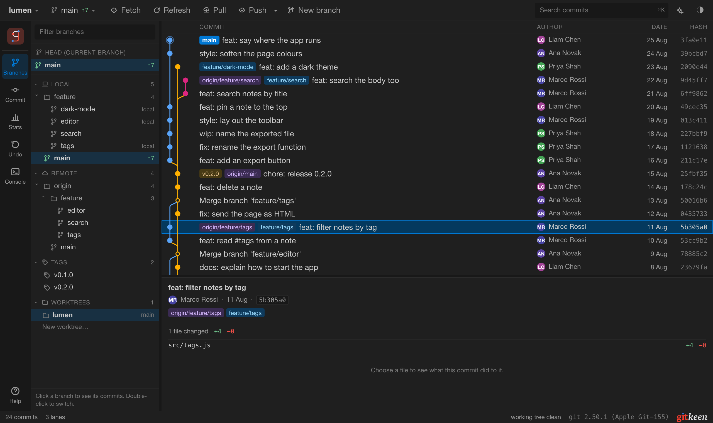
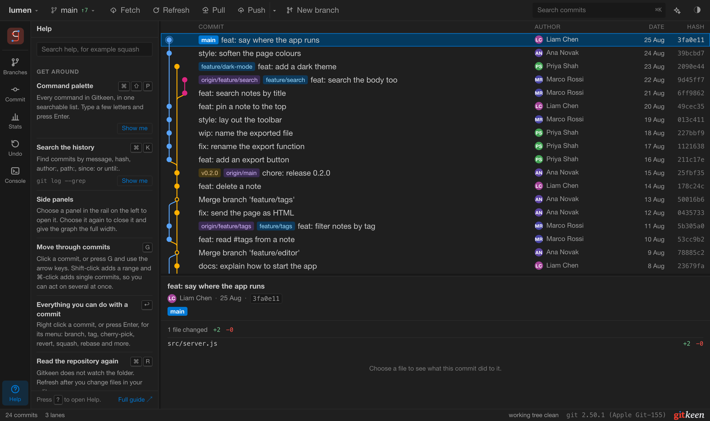

# Getting started

This page shows how to start Gitkeen, open a repository, and find your way
around the window.

## What you need

| Program | Version |
|---|---|
| Git | 2.30 or newer |
| Node.js | 20 or newer, to run Gitkeen from source |

## Start Gitkeen

1. Install the dependencies: `npm install`
2. Start Gitkeen: `npm run dev`
3. Open the address the command prints, normally `http://localhost:5183`.
4. Paste the path of a repository into the box and press **Open**.

You can paste the path of any folder inside the repository. Gitkeen finds the
root itself. The welcome screen also lists the repositories you opened before,
so you can open one again with a click.

You can also open a repository straight from the address bar:

```
http://localhost:5183/?repo=/path/to/repository
http://localhost:5183/?repo=/path/to/repository&theme=light
```

Gitkeen also runs as a desktop app for macOS, with a folder chooser. See
[The desktop app](desktop-app.md).

## The window



| Part | Where | What it holds |
|---|---|---|
| Title bar | Top | The repository and branch, Fetch, Refresh, Pull, Push, New branch, the search box, Settings and the theme menu. |
| Rail | Left edge | Buttons for the side panels: Branches, Commit, Stats, Undo, Console, GitHub for a GitHub repository, and Help at the bottom. |
| Side panel | Next to the rail | The panel you chose in the rail. |
| Graph | Middle | Every commit, with its branches, tags and merges drawn as lanes. |
| Commit details | Below the graph | The message, the author and the changed files of the selected commit. |
| Status bar | Bottom | The state of the working tree, and the buttons to continue or abandon an operation that stopped. |

Choose a panel in the rail to open it. Choose it again to close it, and the
graph gets the full width. The console opens along the bottom of the window,
next to whichever panel is open.

## Selecting commits

Click a commit to select it and read its details. Hold Shift to select a
range, or Command (Control on Windows and Linux) to add single commits. Right
click a commit, or press Enter, for everything you can do with it. When you
select several commits first, the menu acts on all of them.

## Help inside the app

Press **?**, or choose **Help** at the bottom of the rail. The Help panel lists
what Gitkeen can do in short entries, grouped by task, each with its shortcut
and the Git command it matches. Search it, and press **Show me** to go straight
to a feature.



## The command palette

Press Command or Control with Shift and P. The palette lists everything
Gitkeen can do, filters the list as you type, and runs the command you choose
with Enter. Commands that act on commits use the commits you selected.

See [Keyboard shortcuts](keyboard.md) for every key.

## Known limits

1. In the browser there is no folder chooser, so you paste a path. The desktop
   app has one.
2. Gitkeen does not watch the folder for changes. Press **Refresh**, or Command
   with R, after you edit files in your editor.
3. The graph starts with the newest 5000 commits. **Load older commits** at the
   bottom adds more, 5000 at a time.
4. The list of recent repositories is stored in the browser, so it is lost if
   you clear the browser data.
