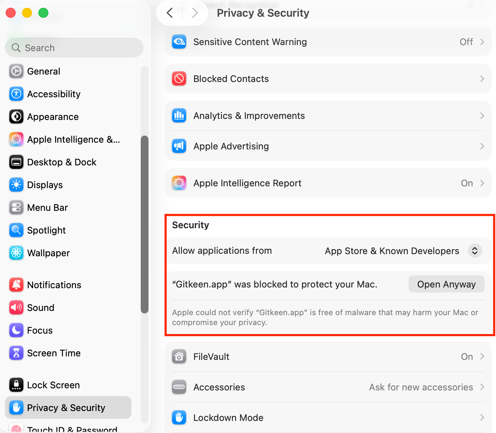

# Installing Gitkeen

You also need Git 2.30 or newer on your computer.

## Which file to download

Download Gitkeen from the [Releases page](https://github.com/tgomilar/gitkeen/releases).
Open the newest release, and under **Assets** choose the file for your system:

| Your system | File |
|---|---|
| macOS on Apple silicon (M1 and newer) | `Gitkeen-macOS-Apple-silicon.dmg` |
| macOS on Intel | `Gitkeen-macOS-Intel.dmg` |
| Windows 10 and 11 | `Gitkeen-Windows-Installer.exe` |
| Linux | `Gitkeen-Linux.AppImage` |
| Debian and Ubuntu | `Gitkeen-Linux.deb` |

On Fedora, openSUSE and other Linux systems, use the AppImage.

A release also lists `.app.tar.gz` files and `latest.json`. Gitkeen uses them
to update itself. You do not need to download them.

## Opening Gitkeen the first time

Gitkeen is not signed with a paid developer certificate yet. Your system
therefore cannot check who made it, and asks you once before it opens it.

### macOS

1. Open the `.dmg` and drag **Gitkeen** to **Applications**.
2. Open Gitkeen. macOS says that it could not verify the app. Press **Done**,
   not **Move to Bin**.
3. Open **System Settings**, then **Privacy & Security**.
4. Scroll down to **Security**. Next to "Gitkeen.app" was blocked to protect
   your Mac, press **Open Anyway**.
5. Confirm with your password or Touch ID. From now on, Gitkeen opens normally.



The button appears only for about an hour after macOS blocked the app. If it is
not there, open Gitkeen again first.

Gitkeen 0.1.0 has a broken signature, so macOS says that the app "is damaged"
and offers no **Open Anyway**. Newer versions do not have this problem. If you
see the message, run this once in Terminal, then open Gitkeen again:

```
xattr -dr com.apple.quarantine /Applications/Gitkeen.app
```

### Windows

1. Run `Gitkeen-Windows-Installer.exe`.
2. If Windows says "Windows protected your PC", press **More info**, then
   **Run anyway**.
3. Install [Git for Windows](https://git-scm.com/download/win) if you do not
   have it yet. Gitkeen uses the `git` it finds on your `PATH`.

### Linux

For the AppImage, make the file executable, then run it:

```
chmod +x Gitkeen-Linux.AppImage
./Gitkeen-Linux.AppImage
```

For the `.deb` package on Debian or Ubuntu:

```
sudo apt install ./Gitkeen-Linux.deb
```

## Updates

Gitkeen is a pre-release for now, and pre-releases do not update themselves.
To move to a newer pre-release, download and install it from the Releases page.
From the first full release on, updates work as described here.

Gitkeen checks for a new version a few seconds after it starts. When there is
one, a message offers **Update and restart**. The update is downloaded, its
signature is checked, and Gitkeen restarts in the new version. To check at
any time, choose **Check for updates** in the command palette.

| Installed from | Updates itself |
|---|---|
| macOS `.dmg` | Yes |
| Windows installer | Yes |
| Linux AppImage | Yes |
| Linux `.deb` | No. Download and install the new package yourself. |
