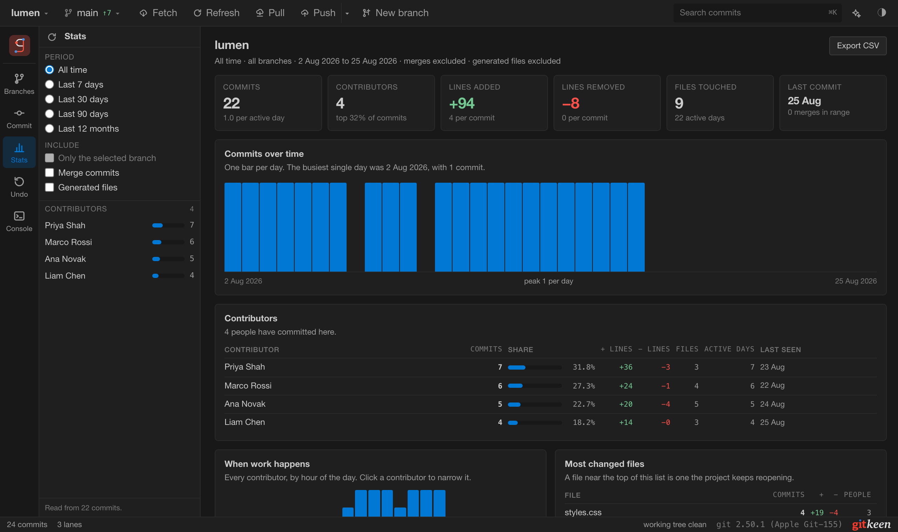

# The Stats report

Press **Stats** in the rail. Gitkeen reads the history and writes a report: how
much work was done, who did it, and when. It answers questions such as these.
Who works on this project? Is the pace steady, or did it stop in March? Which
files does the project keep changing? Does one person hold most of the
knowledge?

The report reads the log and counts. It never changes anything.

## What the report holds

| Part | What it answers |
|---|---|
| Headline numbers | Commits, contributors, lines added and removed, files touched, and the date of the last commit. |
| Commits over time | Whether the pace is steady, growing or stopped. One bar per day, or per month when the history is longer than 120 days. |
| Contributors | Who committed, how much each person did, and when each person was last active. |
| When work happens | The hours of the day and days of the week the work lands on. Click a contributor to see only theirs. |
| Most changed files | The files the project keeps changing, and how many people touched each one. |
| Where the lines go | Which file types the work goes into. |
| Latest commits | The most recent work in the period. |

**Export CSV** saves the contributor table as a file, with every contributor,
not only the 25 on screen.

## Choosing what it counts

The side panel holds the question, and the report answers it. Change anything
there and the report updates.

| Control | What it does |
|---|---|
| Period | All time, the last 7, 30 or 90 days, or the last 12 months. |
| Only the selected branch | Counts only the history of that branch. Choose the branch in the Branches panel first. |
| Merge commits | Off by default. A merge counts as a commit but adds no lines, because its changes are counted on the commits it merges. |
| Generated files | Off by default. Lock files, bundles and vendored folders are written by tools, not by people. |

Generated files are off because they distort the numbers. If
`package-lock.json` counts, whoever last ran an install becomes the largest
contributor.

## Good to know

1. **Dates are commit dates.** A rebased commit keeps its author date but gets
   a new commit date. The report filters and counts by the commit date, so a
   commit is never counted in a period it falls outside.
2. **People are grouped by email address.** One person with two addresses
   appears twice. When one address uses several spellings of a name, the
   report lists them with "also".
3. **The report is read when you open it.** It needs a full pass over the log,
   which takes a few seconds on a large history. Press Command or Control with
   R to read it again.
4. **The newest 20000 commits are counted.** If a repository has more, the
   report says so.
